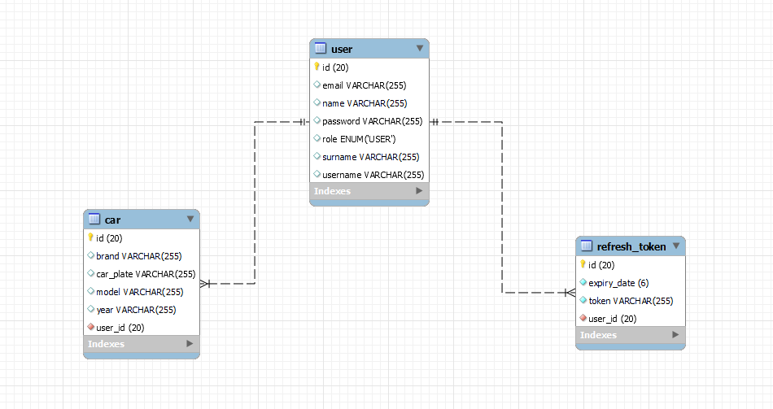

## Patika Bitirme Projesi

#### Task

- Kullanıcı
    - Kullanıcıların sisteme kendi araçlarını kayıt ettiği bir uygulama yazılmalıdır.
    - Kullanıcılar kullanıcı adı ve şifre ile sisteme kayıt olmalı aksi halde API'ye erişimi olmamalıdır.
    - Kullanıcı sadece şifresini değiştirebilir ve eski şifre parametre olarak alınmalıdır
    - Kullanıcı silinebilir ve silindiğinde sisteme kayıtlı araçlar da silinmelidir
- Araç
    - Aynı araç birden fazla kişi tarafından eklenemez.
    - Plakalar boşluk küçük harf ve Türkçe karakter içeremez.
    - Silinebilir ve güncellenebilir.
    - Marka ve modele göre araç getiren servis yazılmalıdır.

### Kullandığım diller kütüphaneler ve araçlar.

- Backend 
    - Spring Boot 
    - Spring Security
    - ModelMapper
    - JWT Authentication
    - Lombok
    - JPA
    - MySql
- Frontend
    - React
    - Redux
    - Redux Persist
    - Formik & Yup
    - React router dom
    - Chakra UI
    - Axios

-------

